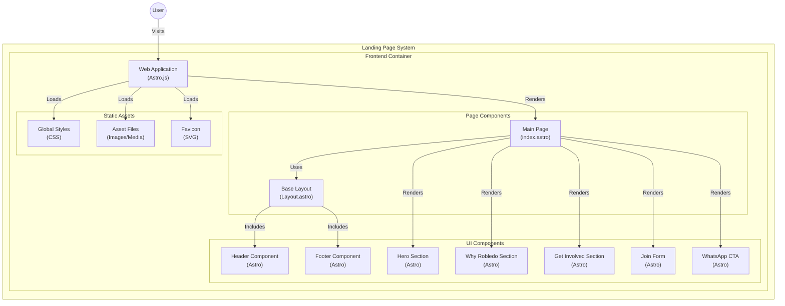

# Queremos que vuelva Robledo


Landing page, de personas que queremos que vuelvan robledo al senado de la república.


**Para iniciar el repo:** 
```bash
git clone https://github.com/SergioTovar94/qvrobledo.git
```
### Nos ubicamos en la carpeta clonada

```bash
cd qvrobledo
```

### Luego instalamos los moduloes

```bash
npm install
```

### Pâra visualizar el repo:

```bash
npm run dev
```

## Estructura:

```text
└── 📁qvrobledo
    └── 📁public
        └── favicon.svg
    └── 📁src
        └── 📁assets
        └── 📁components
            └── Footer.astro
            └── GetInvolved.astro
            └── Header.astro
            └── HeroSection.astro
            └── JoinForm.astro
            └── WhatsAppCTA.astro
            └── WhyRobledo.astro
        └── 📁layouts
            └── Layout.astro
        └── 📁pages
            └── index.astro
        └── 📁styles
            └── global.css
    └── .gitignore
    └── astro.config.mjs
    └── package-lock.json
    └── package.json
    └── README.md
    └── tsconfig.json
```


